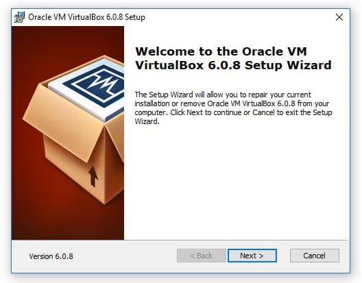
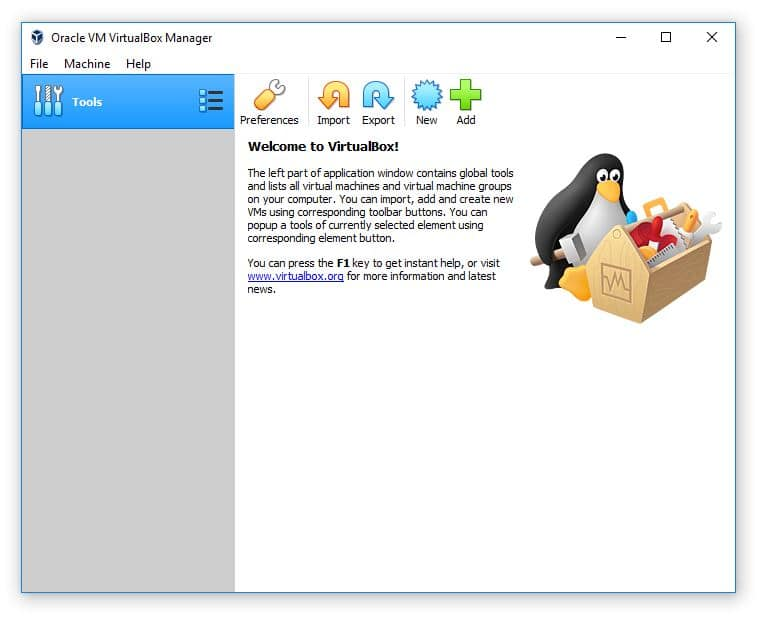
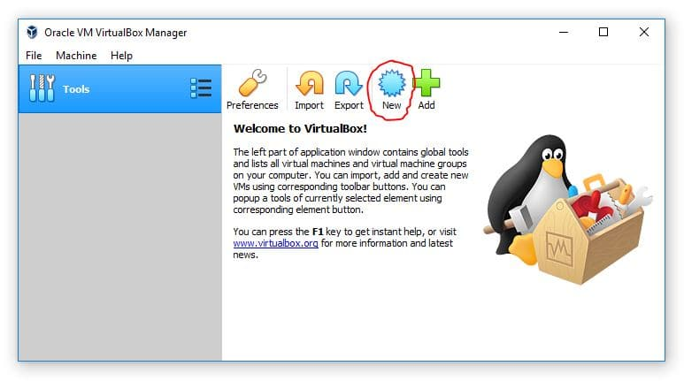

<h1> setting-up-a-virtual-home-lab </h1>
<h2>setting up a virtual home lab </h2>

I built a free virtual IT lab from scratch on my home computer using open-source software. 

 

In the early 2000s the only way one could have built an IT lab was to purchase physical servers or re-purpose old computers. While this can be very beneficial as far as IT experience and skills, it can be much faster simply to build a free virtualized IT lab.

 

Let's dive in!

<h2>Index</h2>

<ul>
<li>Virtualization Overview</li>
<li>Free Virtualization Software</li>
<li>Downloading and Installing VirtualBox</li>
<li>Creating a Virtual Network</li>
<li>Creating a Virtual Machine</li>
<li>Downloading Your operating systems ISO(s)</li>
<li>Installing an OS on Your Lab VMs</li>
<li>Conclusion</li>
</ul>

<h2>Virtualization Overview</h2>

So what is virtualization anyway? Basically, the IT term virtualization refers to the practice of emulating (or simulating) a computer. You can use a Virtual Machine to run a computer as an application on your host computer.

 

On the image below - the top computer would be the host computer. The three computers below the host are referred to as guest virtual machines.

Virtual machines act like real computers, but run as a software program. So you can start, restart, shut down, install software and operating systems just like you would on a normal computer.
This makes virtual machines perfect for IT labs.

<h2>Free Virtualization Software</h2>

With so many different virtualization software options available, it can be pretty confusing to know which one is the "best" and which one you should use. Let's address this now.

 

There is no "best" virtualization software. There are simply different options - and the ones you should consider will depend on your host operating system.

 

In this setup I will be using Oracle VM VirtualBox because it is compatible with both Windows and Linux, but you can use any you want. The steps will nearly be identical to other virtualization software. 

 
<h2>Downloading and Installing VirtualBox</h2>

Download Oracle VM VirtualBox by <a href="url">clicking here.</a> Once the download completes, I launched the installation.

I Proceeded through the installation using all of the default options. Any prompts that are a yes/no you need to select "yes'.

Click Finish and launch VirtualBox.

<h2>Creating a Virtual Machine</h2>

Now that we know what type of virtual network we want to use it's time to create a VM (Virtual Machine). We can do this by clicking the New button within the VirtualBox Manager.

This will launch the new VM window. Go ahead and click the Expert Mode button. Don't worry - it doesn't make the process more difficult it only allows you to create a VM while navigating through less pages.

