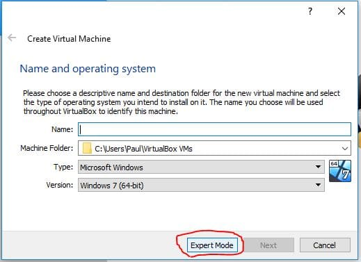
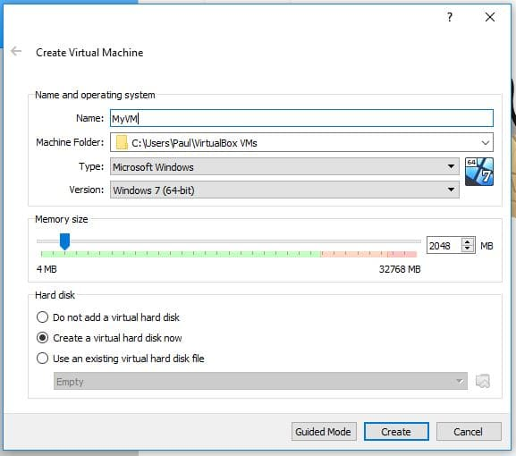
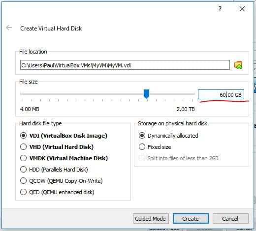
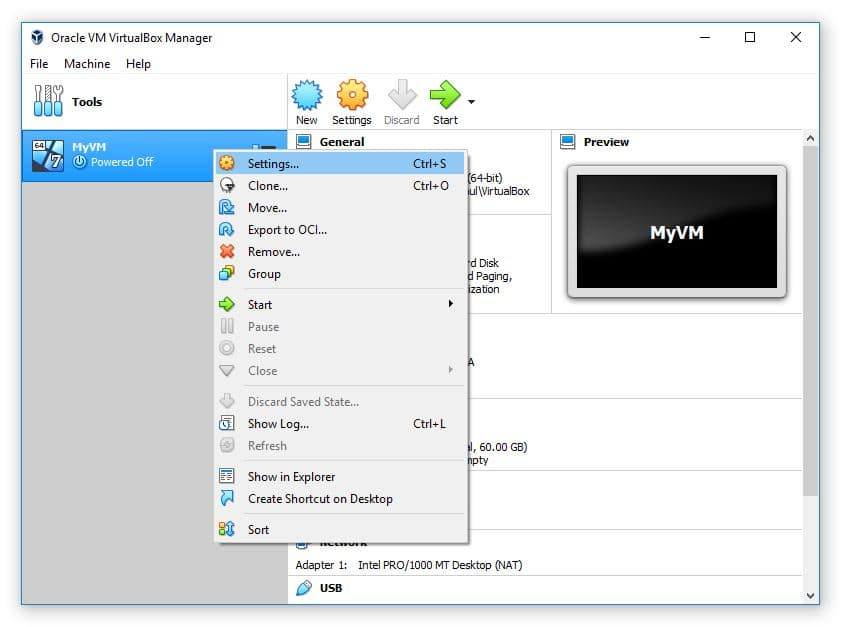
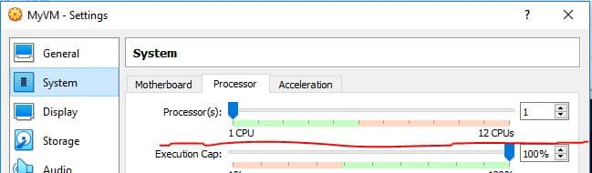
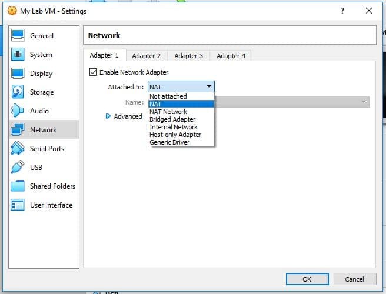
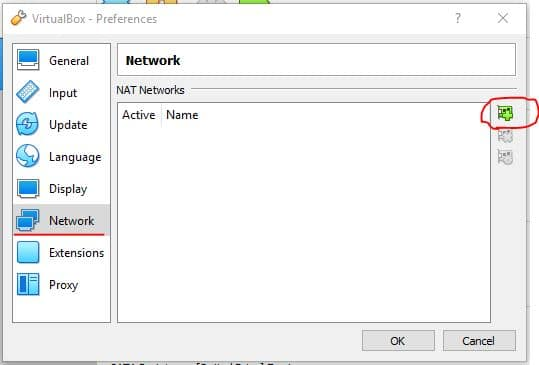

<h1> setting-up-a-virtual-home-lab </h1>
<h2>setting up a virtual home lab </h2>

I built a free virtual IT lab from scratch on my home computer using open-source software. 

 

In the early 2000s the only way one could have built an IT lab was to purchase physical servers or re-purpose old computers. While this can be very beneficial as far as IT experience and skills, it can be much faster simply to build a free virtualized IT lab.

 

Let's dive in!

<h2>Index</h2>

<ul>
<li>Virtualization Overview</li>
<li>Free Virtualization Software</li>
<li>Downloading and Installing VirtualBox</li>
<li>Creating a Virtual Network</li>
<li>Creating a Virtual Machine</li>
<li>Downloading Your operating systems ISO(s)</li>
<li>Installing an OS on Your Lab VMs</li>
<li>Conclusion</li>
</ul>

<h2>Virtualization Overview</h2>

So what is virtualization anyway? Basically, the IT term virtualization refers to the practice of emulating (or simulating) a computer. You can use a Virtual Machine to run a computer as an application on your host computer.

 

On the image below - the top computer would be the host computer. The three computers below the host are referred to as guest virtual machines.

Virtual machines act like real computers, but run as a software program. So you can start, restart, shut down, install software and operating systems just like you would on a normal computer.
This makes virtual machines perfect for IT labs.

<h2>Free Virtualization Software</h2>

With so many different virtualization software options available, it can be pretty confusing to know which one is the "best" and which one you should use. Let's address this now.

 

There is no "best" virtualization software. There are simply different options - and the ones you should consider will depend on your host operating system.

 

In this setup I will be using Oracle VM VirtualBox because it is compatible with both Windows and Linux, but you can use any you want. The steps will nearly be identical to other virtualization software. 

 
<h2>Downloading and Installing VirtualBox</h2>

Download Oracle VM VirtualBox by <a href="url">clicking here.</a> Once the download completes, I launched the installation.

I Proceeded through the installation using all of the default options. Any prompts that are a yes/no you need to select "yes'.

Click Finish and launch VirtualBox.

<h2>Creating a Virtual Machine</h2>

Now that we know what type of virtual network we want to use it's time to create a VM (Virtual Machine). We can do this by clicking the New button within the VirtualBox Manager.

This will launch the new VM window. Go ahead and click the Expert Mode button. Don't worry - it doesn't make the process more difficult it only allows you to create a VM while navigating through less pages.

I am going to specify a name of "MyVM" and 2048 MB (2gb) of RAM then I will click Create.

This will open another window for creating the Virtual Hard Disk. The default options here are all fine except for the File Size. I am going to set my new HDD to 60GB and then choose Create.

Since this HDD is going to be dynamically allocated (option on the middle-right of the screenshot below), the HDD file will only be as large as the amount of data stored on it - and a maximum of 60GB
Now you will see MyVM listed on the VirtualBox dashboard. Before we start the VM we can modify the settings of the VM if we want. Generally you might want to assign more processors, change the networking adapters and mount an ISO.

Increasing the processor CPUs can greatly improve the performance of your VM, so if at all possible increase the number of CPUs to 2.
Pro tip: Storing the VM's hard disk file on an SSD will also significantly increase the VMs performance.

And that is all we need to do to create the VM. Of course we can't start the VM yet because we haven't downloaded or attached an operating system ISO... But we will cover that in the next section.

<h2>Creating a Virtual Network with VirtualBox</h2>

Virtual Networks allow you to connect your VMs to whatever you want. There are several different types of networks you can create with VirtualBox and the one you chose will depend on your requirements.

 

Keep in mind that you won't be able to access all of these network types if you haven't created a VM because some of them are configured from within the VM settings.

 

Here is an overview of the different network types you could create:

<h2>NAT</h2>

This network type allows your VMs to use the internet connectivity of the host computer. You will have no connectivity to other VMs or the host computer. Use this type if your lab will only have one VM.

 

Using NAT is as simple as right-clicking your VM and selecting Settings then navigating to the Network tab (image above)

<h2>NAT Network</h2>

This network is the same as NAT, but it allows your VMs to communicate to other VMs that are attached to the same NAT network. Use this when your labs use multiple VMs and need internet connectivity.

 

You can create a NAT Network by clicking on File > Preferences. Select the Network tab and then click the plus button to create a new NAT Network.

<h2>Bridged Adapter</h2>

Using this network type will cause your router to treat your VM as a physical computer. This means your VM will be connected to the same network as your host computer. Use this lab when you need to access your VMs from your host network.

Using a bridged adapter is as simple as right-clicking your VM and selecting Settings then navigating to the Network tab (image above)

<h2>Internal Network</h2>

This network provides your VMs with connectivity but no external access. Use this when you want to create an isolated IT lab.
Using an Internal Network is as simple as right-clicking your VM and selecting Settings then navigating to the Network tab (image above)

<h2>Host-only Adapter</h2>

This is essentially the same as an internal network, except that your host computer will have a direct IP connection to the VM. Meaning you can RDP, SSH or ping the VMs from the host computer. Use this network type when you will need direct access to the VMs from your host computer. It is commonly used for test web servers (think copying files from the host computer to the VM web server, or directly editing the code on the web server VM from your host computer.

 

You can create a host-only network by select File > Host Network Manager

